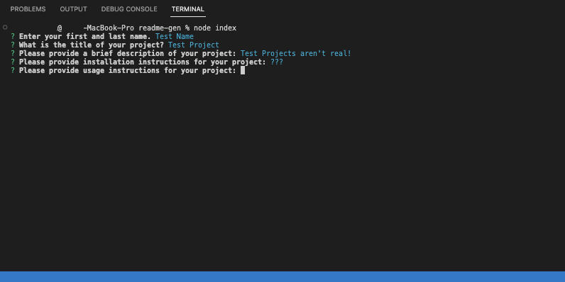

# README-Gen

## Description:
This project utilizes the terminal, node, inquirer and 'fs' to create a README.md using the users inputs!

## Table of Contents:

* [Installation](#installation)
* [Usage](#usage)
* [License](#license)
* [Contributing](#contributing)
* [Tests](#tests)
* [Questions](#Questions)
* [Email](#Email)
* [Github](#Github)
* [Owner](#Owner)

## Installation:

Type "npm i inquirer" into the terminal.

## Usage:

Type "node index" into the terminal after installing inquirer.

## Screenshot:

## Video Demo:
https://user-images.githubusercontent.com/119437696/221332864-bb0a65b8-cfe2-42d0-84ad-534a32b6bfdc.mp4

## License

This project is licensed under the MIT license. Click [here](https://opensource.org/licenses/MIT) for more information. 

## Contributing:

None at this time.

## Tests:

There are currently no tests.

## Questions:
## Email:
If you have any questions email me directly at domenicoabarberi@gmail.com.

## Github:
Please visit my [GitHub](https://github.com/DomenicoBarb) to view my other work.

## Owner:
Nico Barberi
